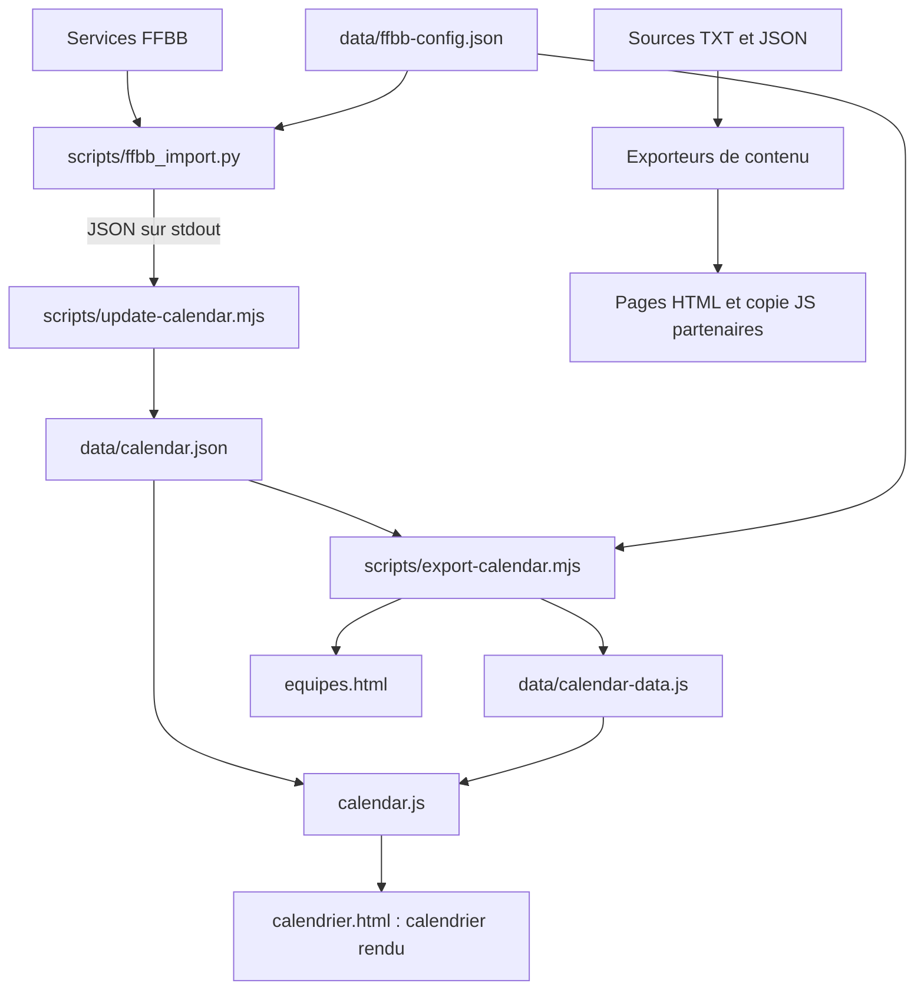

# AST Basket — Documentation technique de maintenance

Ce document décrit le fonctionnement des sources locales revues le 5 octobre 2026.
Il s'adresse à la personne qui reprend le développement, actualise les contenus,
diagnostique un incident ou publie une nouvelle version du site.

Le [README](README.md) présente le projet et son utilisation courante.
[CALENDRIER.md](CALENDRIER.md) fournit la procédure d'actualisation FFBB.
Le présent document détaille les contrats entre fichiers, les responsabilités des
programmes, les contrôles existants et les limites à prendre en compte.
Les règles éditoriales applicables sont dans [AGENTS.md](AGENTS.md).

## Sommaire

1. [Architecture et environnements](#1-architecture-et-environnements)
2. [Inventaire des composants](#2-inventaire-des-composants)
3. [Installation et prise en main](#3-installation-et-prise-en-main)
4. [Sources de référence et fichiers générés](#4-sources-de-référence-et-fichiers-générés)
5. [Contrats de données](#5-contrats-de-données)
6. [Programmes exécutés dans le navigateur](#6-programmes-exécutés-dans-le-navigateur)
7. [Chaîne d'import FFBB](#7-chaîne-dimport-ffbb)
8. [Générateurs de contenu](#8-générateurs-de-contenu)
9. [Structure HTML, styles et accessibilité](#9-structure-html-styles-et-accessibilité)
10. [Procédures de maintenance](#10-procédures-de-maintenance)
11. [Tests et vérification](#11-tests-et-vérification)
12. [Automatisation et publication](#12-automatisation-et-publication)
13. [Diagnostic et récupération](#13-diagnostic-et-récupération)
14. [Limites connues et points de vigilance](#14-limites-connues-et-points-de-vigilance)
15. [Conventions de contribution](#15-conventions-de-contribution)

## 1. Architecture et environnements

Le site est constitué de pages HTML statiques, de CSS et de JavaScript natif.
Il ne contient ni serveur applicatif, ni base de données, ni framework de rendu,
ni chaîne de compilation npm. Chaque page possède son propre en-tête et pied de
page. Les comportements communs sont partagés par les fichiers JS et CSS.

Trois contextes d'exécution doivent être distingués :

| Contexte | Responsabilité | Accès réseau |
| --- | --- | --- |
| Navigateur, ouverture `file://` | Afficher le HTML et les données embarquées | Les liens externes seulement nécessitent Internet |
| Navigateur, site HTTP(S) | Afficher les pages et charger les JSON publics du site | Calendrier et partenaires lisent leurs JSON ; aucun appel FFBB direct |
| Poste de maintenance ou GitHub Actions | Valider les sources, générer les pages, importer les rencontres | Seul l'import FFBB utilise les services FFBB ; les exporteurs fonctionnent hors réseau |



Le navigateur ne peut pas mettre à jour les fichiers du dépôt. Recharger une page
ne lance pas d'import FFBB. Une nouvelle récupération doit être enregistrée dans
le dépôt puis publiée sur l'hébergement pour devenir visible sur le site distant.

## 2. Inventaire des composants

### 2.1 Pages et feuilles de style

Les 13 pages chargent `styles.css` et `script.js`.

| Fichier | Rôle | Complément spécifique |
| --- | --- | --- |
| `index.html` | Accueil, identité et coordonnées | Contenu manuel |
| `club.html` | Présentation et histoire | Texte repris manuellement de `Texte/Historique_AST.txt` |
| `gymnases.html` | Salles, adresses et accès | Contenu manuel |
| `equipes.html` | École de basket, jeunes, séniors | Listes jeunes/séniors générées |
| `ecole-de-basket.html` | Micro-basket, mini-basket, équipes U5 à U11 | `ecole-de-basket.css`, zone SCHOOL générée |
| `basket-sante.html` | Présentation, séances et médias Basket Santé | `basket-sante.css`, zone BASKET-SANTE générée |
| `calendrier.html` | Calendrier et résultats hebdomadaires | `data/calendar-data.js`, puis `calendar.js` |
| `inscription.html` | Démarches, documents et permanences | `inscription.css`, `permanences.js`, JSON embarqué |
| `partenaires.html` | Cartes et liens des partenaires | `partners.css`, `data/partners-data.js`, puis `partners.js` |
| `actualites.html` | Emplacements de publications | Contenu manuel, actuellement en attente |
| `evenements.html` | Page d'attente | Contenu manuel |
| `boutique.html` | Page d'attente | Contenu manuel |
| `contact.html` | Contact du club | Lien email ; aucun traitement de formulaire |

`Image_AST/` contient l'identité et les images des rubriques du club.
`Partenaires/` contient les logos référencés par les données partenaires.
La casse et les chemins relatifs doivent être conservés lors de la publication.

### 2.2 Programmes

| Programme | Exécution | Entrée principale | Sortie / effet |
| --- | --- | --- | --- |
| `script.js` | Navigateur, toutes les pages | DOM de navigation | Ouverture, fermeture, focus |
| `calendar.js` | Navigateur ; fonctions pures importables sous Node | Instantané calendrier | DOM de `#weekly-calendar` |
| `partners.js` | Navigateur | JSON partenaires ou copie locale | Cartes, liens et navigation clavier |
| `permanences.js` | Navigateur ; calcul importable sous Node | JSON de `#permanences-data` | Tableau mensuel et détails |
| `scripts/update-calendar.mjs` | Node, CLI | Sortie du processus Python | JSON puis export calendrier |
| `scripts/ffbb_import.py` | Python, CLI ou import dans les tests | Configuration et API FFBB | JSON sur stdout, sans écrire le site |
| `scripts/export-calendar.mjs` | Node, CLI ou fonction exportée | JSON calendrier et configuration | Copie JS et listes d'équipes |
| `scripts/export-partners.mjs` | Node, CLI | JSON partenaires et images locales | `data/partners-data.js` |
| `scripts/export-inscriptions.mjs` | Node, CLI | JSON inscriptions | Liens, valeurs et permanences dans le HTML |
| `scripts/export-basket-sante.mjs` | Node, CLI | TXT et JSON Basket Santé | Zone BASKET-SANTE |
| `scripts/export-ecole-de-basket.mjs` | Node, CLI | TXT et JSON école de basket | Zone SCHOOL |
| `scripts/calendar.test.mjs` | Tests Node | Fonctions, instantané, lanceur | Vérifications hors réseau |
| `scripts/permanences.test.mjs` | Tests Node | Calcul mensuel et HTML | Vérifications hors réseau |
| `scripts/test_ffbb_import.py` | unittest Python | Modèles SDK et client simulé | Vérifications hors réseau |

Les fichiers `data/*-data.js` sont des données sérialisées, pas des programmes à
maintenir manuellement. Leur commentaire de provenance est produit par l'exporteur.
Les bibliothèques installées dans `.venv/` sont externes au code du projet.

## 3. Installation et prise en main

### 3.1 Préconditions

- Navigateur récent pour le site : `fetch`, `Intl`, `replaceChildren`, `inert`,
  `AbortSignal.timeout` et CSS Grid sont utilisés.
- Node.js 22 ou ultérieur pour les scripts et tests JavaScript.
- Python 3.10 ou ultérieur pour l'import et les tests FFBB.
- Git pour l'historique et la publication des modifications.
- Accès Internet pour installer les dépendances et lancer un import réel.

Les versions du workflow sont Node 24 et Python 3.12. Le fichier
`requirements-ffbb.in` fixe `ffbb-api-client-v2==1.4.0` et, sous Windows,
`tzdata==2026.5`. Les dépendances transitives du client ne sont pas verrouillées
dans un fichier de résolution complet.

### 3.2 Windows / PowerShell

Toutes les commandes suivantes sont exécutées à la racine du dépôt.
L'activation de l'environnement virtuel n'est pas nécessaire : le chemin explicite
évite les ambiguïtés entre plusieurs installations Python.

```powershell
python -m venv .venv
.\.venv\Scripts\python.exe -m pip install -r requirements-ffbb.in
node --version
.\.venv\Scripts\python.exe --version
node --test scripts/calendar.test.mjs scripts/permanences.test.mjs
.\.venv\Scripts\python.exe -m unittest discover -s scripts -p "test_*.py"
```

### 3.3 Linux / macOS

```sh
python3 -m venv .venv
.venv/bin/python -m pip install -r requirements-ffbb.in
node --test scripts/calendar.test.mjs scripts/permanences.test.mjs
.venv/bin/python -m unittest discover -s scripts -p 'test_*.py'
```

Le lanceur `update-calendar.mjs` sélectionne successivement `FFBB_PYTHON`, le
Python de `.venv`, puis la commande `python` du PATH. Sur une machine ne proposant
que `python3`, créer `.venv` ou préciser `FFBB_PYTHON`.

### 3.4 Prévisualisation

Ouvrir `index.html` permet de vérifier le fonctionnement local. Pour reproduire
le chargement HTTP des JSON, un serveur de développement local suffit :

```powershell
.\.venv\Scripts\python.exe -m http.server 8000 --bind 127.0.0.1
```

Consulter ensuite `http://127.0.0.1:8000/` ; arrêter le serveur avec Ctrl+C.
Ce serveur sert uniquement à la vérification locale et n'exécute pas les imports.

## 4. Sources de référence et fichiers générés

| Contenu à modifier | Source de référence | Commande à exécuter | Fichiers à livrer après génération |
| --- | --- | --- | --- |
| Résultats, dates et horaires des rencontres | FFBB via le client ; configuration locale | `node scripts/update-calendar.mjs` | `data/calendar.json`, `data/calendar-data.js`, `equipes.html` |
| Libellés et liste des équipes visibles | `data/ffbb-config.json` | `node scripts/export-calendar.mjs` pour `displayTeams` ; réimport pour appliquer `teamLabels` aux matchs | Copie JS, `equipes.html`, et JSON si réimport |
| Partenaires | `data/partners.json`, images de `Partenaires/` | `node scripts/export-partners.mjs` | JSON, copie JS, images concernées |
| Liens, paiement, contact, permanences | `data/inscriptions-source.json` | `node scripts/export-inscriptions.mjs` | JSON et `inscription.html` |
| Textes d'inscription | `Texte/Inscriptions_AST_source.txt` | Report éditorial manuel | TXT et `inscription.html` |
| Basket Santé | `Texte/Basket_sante_AST_source.txt`, `data/basket-sante-source.json` | `node scripts/export-basket-sante.mjs` | Sources, `basket-sante.html`, images concernées |
| École de basket | `Texte/Ecole_de_basket_AST_source.txt`, `data/ecole-de-basket-source.json` | `node scripts/export-ecole-de-basket.mjs` | Sources, `ecole-de-basket.html`, images concernées |
| Histoire | `Texte/Historique_AST.txt` | Report manuel | TXT et `club.html` |
| Navigation, autres pages | HTML concerné | Aucune génération globale | Toutes les pages modifiées |

Les TXT portent les textes éditoriaux ; les JSON portent les liens et données
structurées. `BACKLOG.txt` constitue l'exception explicitement prévue pour le suivi
interne. La documentation technique est en Markdown. Les notes historiques à la
racine ne sont pas des entrées des générateurs décrits ici.

Les zones générées ne doivent pas être corrigées directement : la prochaine
exécution écraserait ces corrections. Une modification de modèle se fait dans le
script exporteur ; une modification de contenu se fait dans sa source.

## 5. Contrats de données

### 5.1 Configuration FFBB

Fichier : `data/ffbb-config.json`.

| Champ | Type / rôle | Point de maintenance |
| --- | --- | --- |
| `baseUrl` | URL de provenance enregistrée dans l'instantané | Le client utilise sa propre URL par défaut ; changer ce champ seul ne redirige pas ses appels |
| `documentationUrl` | Référence du client utilisé | Mise à jour lors d'une migration |
| `club.id` | Identifiant numérique FFBB | Sert aux filtres et aux contrôles d'appartenance |
| `club.code` | Code officiel du club | Comparé à la réponse de `get_organisme` |
| `club.url` | Page officielle du club | Source et base des liens d'engagement |
| `displayTeams[]` | Équipes réellement présentées sur `equipes.html` | `name`, `category` (`young`/`senior`), `engagementId` facultatif |
| `teamLabels` | Dictionnaire identifiant d'engagement → libellé court | Appliqué lors de l'import, pas à chaque rendu navigateur |

`displayTeams` et `teams` dans l'instantané n'ont pas la même signification.
La première liste représente les équipes du club à montrer ; la seconde regroupe
des engagements sportifs, parfois multiples pour une même équipe.

### 5.2 Enveloppe du calendrier

Fichier : `data/calendar.json`. Les identifiants normalisés sont des chaînes
numériques pour conserver un format de jointure stable entre Python et JavaScript.

| Champ | Contenu |
| --- | --- |
| `updatedAt` | Date UTC ISO de fin de construction de l'import |
| `source`, `sourceType`, `api` | Provenance ; `sourceType` vaut `api` |
| `client`, `clientVersion` | Client et version utilisés ; version aussi déclarée dans le code Python |
| `seasonIds[]` | Identifiants des saisons actives retenues |
| `warnings[]` | Métadonnées annexes refusées/absentes via HTTP 403/404 |
| `teams[]` | Engagements normalisés |
| `matches[]` | Rencontres triées par date, libellé d'équipe et identifiant |
| `standings[]` | Classements disponibles, non affichés actuellement |

`updatedAt` prouve qu'un import a été effectué ; il ne certifie pas que chaque
résultat a déjà été saisi par la fédération. Les métadonnées `warnings` ne sont pas
affichées dans la page : elles servent au diagnostic des données.

### 5.3 Engagements et rencontres

Un élément `teams[]` contient :

| Champ | Sens |
| --- | --- |
| `id` | Identifiant d'engagement |
| `label` | Libellé court configuré, sinon nom de compétition, sinon nom AST du match |
| `description` | Nom de compétition, ou `null` si inaccessible |
| `category` | Catégorie déduite du nom (`young`/`senior`) ou `null` ; ce n'est pas la source de `displayTeams` |
| `number` | Numéro d'équipe sous forme de chaîne, ou `null` |
| `pouleId` | Poule de l'engagement, ou `null` |
| `source` | URL d'engagement si retrouvé dans la collection, sinon URL du club |
| `count` | Nombre de rencontres attribuées à cet engagement dans l'instantané |

Un élément `matches[]` contient :

| Champ | Type / invariant |
| --- | --- |
| `id`, `teamId` | Identifiants de rencontre et d'engagement AST |
| `team` | Libellé AST destiné à l'affichage |
| `date` | Heure civile française `YYYY-MM-DDTHH:MM:SS`, sans suffixe de fuseau, ou `null` |
| `home`, `away` | Noms des équipes dans l'ordre domicile/extérieur |
| `atHome` | Booléen déterminé par les identifiants de club |
| `played` | Booléen provenant de `joue` |
| `homeScore`, `awayScore` | Entiers positifs ou nuls, ou `null` ; toujours `null` si non joué |
| `round` | Numéro de journée fourni par le client, éventuellement absent |
| `url` | Lien individuel officiel, sinon lien de l'engagement/du club |
| `location` | Libellé de salle ou `null` |
| `competition` | Description de compétition ou `null` |
| `pouleId` | Poule propre à la rencontre ou `null` |

Exemple de structure fictive, sans valeur de résultat de référence :

```json
{
  "id": "30", "teamId": "10", "team": "NF2",
  "date": "2026-10-03T20:00:00", "home": "Adversaire", "away": "AST",
  "atHome": false, "played": true, "homeScore": 60, "awayScore": 70,
  "round": "3", "url": "https://competitions.ffbb.com/",
  "location": null, "competition": "Nationale féminine 2", "pouleId": "20"
}
```

Ne pas transformer un score absent en zéro et ne pas permuter les scores pour
placer l'AST à gauche. Le surlignage utilise `atHome` pour identifier son nombre.

Un classement contient `id`, `name`, `available` et `rows`. Les lignes sont issues
de `dataclasses.asdict` sur les modèles du client. Leur schéma dépend donc du SDK,
contrairement au contrat `matches` explicitement construit par le projet.

### 5.4 Partenaires

`data/partners.json` contient une liste `partners`. Chaque partenaire doit avoir
un `id` unique, un `name`, une `image` et une liste `links`.
Les images exportées sont limitées à un fichier PNG/JPG/JPEG directement sous
`Partenaires/`. Chaque lien a `label`, `url` HTTPS et `enabled` booléen.

Un lien désactivé reste dans les données, mais n'est pas rendu. Les informations
de provenance et les réserves éditoriales, telles que `sources` et `reviewNote`,
ne sont pas montrées par les cartes. Elles restent néanmoins présentes dans les
JSON et copies JS publics : ne pas y mettre d'information confidentielle.

### 5.5 Inscriptions et permanences

`data/inscriptions-source.json` contient `links`, `contactEmail`, `paymentMethods`
et `permanences`. Les dates complètes sont nécessaires au filtrage par mois/année.

```json
{
  "date": "2027-06-12",
  "start": "10:00",
  "end": "12:00",
  "location": "Lieu à renseigner"
}
```

Cet exemple décrit le format, pas une permanence annoncée. L'exporteur vérifie
la date civile, les heures entre 00:00 et 23:59, `end > start` et le lieu non vide.
Plusieurs entrées peuvent partager une date. Une séance traversant minuit doit
être représentée autrement : le format actuel la refuse.

### 5.6 Basket Santé et école de basket

Pour Basket Santé, le JSON contient `contactEmail`, `schedule` (jour, début, fin,
lieu, lien), `images` (chemin, texte alternatif, dimensions) et `videos` (URL).
Les champs de provenance ne sont pas une demande de téléchargement : l'exporteur
utilise les images déjà présentes. Les paragraphes TXT sont découpés sur les
lignes vides, puis référencés par indice dans le modèle.

Pour l'école, le TXT contient les rubriques `[micro]` et `[mini]`. Le JSON contient
`links`, `micro`, `mini`, `images` et `teams`. Les équipes de l'école ont notamment
`name`, `coach`, `role` et `image`. Une entrée image dont `src` est `null` documente
une source indisponible ; elle n'est pas un fichier à charger.

## 6. Programmes exécutés dans le navigateur

### 6.1 Navigation — `script.js`

Le script est chargé après le HTML. `setMenu(open)` synchronise `.is-open`,
`aria-expanded` et le texte `.sr-only` du bouton. Fermer le menu referme aussi les
`details[open]` présents dans la navigation.

Le clic sur une destination ferme le menu. Échap rend le focus au bouton mobile.
Chaque `.club-dropdown` se ferme au clic extérieur ; Échap sur un sous-menu stoppe
la propagation pour éviter de fermer aussi le menu principal et cible son `summary`.
Le seuil de passage en menu mobile est dans le CSS, pas dans le JavaScript.

### 6.2 Calendrier — `calendar.js`

L'IIFE asynchrone isole ses variables. Sous Node, elle exporte `shift`, `monday`,
`groupWeeks` et `result`, puis s'arrête avant d'accéder au DOM.

Ordre de chargement nécessaire : `data/calendar-data.js` puis `calendar.js`.
Le premier définit `window.AST_CALENDAR`. En HTTP(S), le second essaie
`fetch('data/calendar.json', { cache: 'no-store', ... })` avec dix secondes de délai.
Une erreur conserve la copie JS ; en `file://`, seule cette copie est utilisée.

Le calcul de la date courante utilise `Europe/Paris`. Les opérations sur les jours
utilisent midi UTC pour éviter les décalages aux changements d'heure. Les chaînes
de dates locales ne sont pas traitées comme des instants UTC pour l'affichage des
horaires : la portion `HH:MM` est extraite telle quelle.

`groupWeeks` exclut les dates absentes, regroupe au lundi puis trie par date et
équipe. L'interface inclut toutes les semaines entre les bornes des données et la
semaine courante. Elle démarre sur la semaine courante, même si elle est vide.
Les résultats du week-end passé peuvent donc se trouver dans la semaine précédente.

`result` retourne le score si `played` et les deux entiers sont présents ; sinon
« Aujourd'hui », « À venir » ou « Score indisponible » selon la date.
`matchCard` surligne seulement le score AST : vert si supérieur, rouge si inférieur.
Les scores égaux ou incomplets restent neutres. Le nom AST est également en gras.
Un titre sur le nombre indique victoire/défaite.

`render` reconstruit la liste par jour, actualise le résumé `role="status"` et les
limites des flèches. Les rencontres sans date sont rendues dans une section séparée.
Les éléments sont créés avec `textContent`, sans injecter les noms FFBB en HTML.

### 6.3 Partenaires — `partners.js`

Le script attend `[data-partners-grid]` et `[data-partners-status]`. Il lit le JSON
sur HTTP(S) et `window.AST_PARTNERS` uniquement en `file://`. Contrairement au
calendrier, il ne retombe pas sur la copie JS en cas d'échec HTTP : il présente un
bouton Réessayer. Il ne force pas non plus `cache: 'no-store'` sur cette requête.

`createCard` crée un bouton recto et un groupe verso. Seuls les liens HTTPS avec
`enabled === true` apparaissent. Une image en erreur est masquée ; le nom reste.
`closeCurrent` assure qu'une seule carte est ouverte. `inert` et `aria-hidden`
suivent la face visible, et le focus passe au premier lien ou au bouton de retour.

Le bouton de retour couvre le verso via le CSS. Les liens ont leur propre couche
cliquable, ce qui permet de les ouvrir sans retourner la carte. Échap ferme la
carte et rend le focus au recto. Les nouvelles fenêtres utilisent
`rel="noopener noreferrer"`.

### 6.4 Permanences — `permanences.js`

`monthDays(year, month, events)` utilise des mois de 0 à 11. Il produit une liste
complétée par des cellules `null` pour des semaines du lundi au dimanche. Chaque
jour contient la liste des événements dont la date complète correspond.

Le composant lit le JSON de `#permanences-data` et utilise `#permanences-calendar`,
`#permanences-month`, `#permanences-days`, `#permanences-details` et
`#permanences-today`. Les boutons précédent/suivant portent `data-month-offset`.

Il suit le fuseau local du navigateur, affiche les jours avec permanence et leurs
détails, distingue le jour courant par `aria-current="date"`, puis retire `hidden`
du calendrier. L'année est conservée en mémoire mais omise des libellés affichés.
Le retour au mois courant recalcule le mois ; le repère « aujourd'hui » provient
de la date mémorisée au chargement de la page.

## 7. Chaîne d'import FFBB

### 7.1 Lanceur Node

`scripts/update-calendar.mjs` résout les chemins à partir de son propre fichier.
Il lance Python avec `execFile` sans shell, impose UTF-8, attend un JSON sur stdout
et limite la sortie à 20 Mio et le processus à douze minutes.

Après succès, il vérifie les tableaux non vides et le nom du client, écrit
`data/calendar.json.tmp`, puis le renomme en `data/calendar.json`. Il appelle
ensuite `exportCalendar`. Toute exception positionne le code de sortie à 1.

Un échec du processus Python ne modifie pas les sorties. En revanche, un échec
ultérieur d'`exportCalendar` peut laisser le JSON nouveau et les autres fichiers
anciens : il n'y a pas de transaction globale sur les trois fichiers.

### 7.2 Initialisation Python

`main()` lit la configuration, crée une session `CachedSession` en mémoire avec
expiration immédiate, installe `validate_response` et récupère les jetons avec
`TokenManager`. `CacheConfig(enabled=False)` est utilisé pour leur résolution.
Les jetons ne sont jamais intégrés dans l'instantané.

Le SDK accepte les variables `API_FFBB_APP_BEARER_TOKEN` et
`MEILISEARCH_BEARER_TOKEN`. Le projet ne contient pas son propre chargeur `.env` :
fournir les variables à l'environnement du processus si nécessaire.

La configuration Directus prévoit trois tentatives, dix secondes pour la connexion
et soixante secondes pour la lecture. Ces paramètres complètent la limite globale
du lanceur Node. Les avertissements du convertisseur SDK sur les champs annexes
sont filtrés ; les erreurs bloquantes continuent de remonter.

### 7.3 Construction de l'instantané

1. `get_organisme` vérifie identifiant et code du club.
2. `get_saisons` fournit les saisons actives ; leur absence bloque l'import.
3. `list_all_rencontres` filtre domicile **ou** extérieur et saison active, avec
   pages de 100, tri `id` et limite de 10 000. Une liste vide ou atteignant cette
   limite est refusée, ainsi que les doublons ou une saison étrangère.
4. Les engagements à lire sont l'union de ceux de la fiche club et des matchs.
   Tous ceux de la fiche club doivent être retrouvés dans la collection.
5. Un engagement référencé seulement par des matchs peut être reconstitué depuis
   ces matchs si l'identifiant de compétition est unique et renseigné.
6. Les compétitions sont résolues une fois par import. Le nom configuré dans
   `teamLabels` est prioritaire. Sans métadonnée de compétition, le nom AST du
   match sert de repli, et les champs inconnus restent `null`.
7. Les salles sont résolues une fois ; `normalize_match` valide puis adapte chaque
   rencontre. Les compteurs par engagement sont incrémentés.
8. Les poules des rencontres alimentent les classements, en conservant un état
   indisponible quand une métadonnée ne peut pas être lue.
9. L'enveloppe reçoit la date d'import et est sérialisée une seule fois sur stdout.

### 7.4 Validation des réponses et erreurs

Le hook `validate_response` contrôle les réponses HTTP 200 sous `/items/` :
présence de `data`, puis longueur des pages demandant `meta` par rapport à
`filter_count`, `limit` et `offset`. Il vise à empêcher une fin de pagination
prématurée de passer pour un import complet.

| Situation | Comportement |
| --- | --- |
| Mauvais club, doublon, saison inconnue, statut inconnu | Échec complet |
| Engagement déclaré par le club mais absent de la collection | Échec complet |
| Engagement ancien seulement connu par ses rencontres | Reconstruction contrôlée depuis les identifiants du match |
| Score joué négatif ou de type incorrect | Échec complet |
| Score absent | `null`, sans score inventé |
| HTTP 403/404 sur compétition, salle ou poule via `fetch_detail` | Avertissement et métadonnée vide |
| Erreur sur les rencontres, saisons ou engagements | Échec complet |
| HTTP 401, serveur, réseau ou timeout | Échec complet |

Une réponse annexe vide (`None`) est traitée comme absente ; seules les exceptions
HTTP 403/404 sont ajoutées explicitement à `warnings`. L'absence de warning n'est
donc pas une preuve que tous les champs annexes sont renseignés.

### 7.5 Dates, identités et règles de score

`club_side` utilise les identifiants d'organisme et d'engagement, jamais une
recherche du mot Tournefeuille dans le nom. `identifier` normalise en chaîne.
`local_date` conserve une date naïve en heure française ; une date avec fuseau est
convertie vers `Europe/Paris` avant suppression du fuseau.

`normalize_match` exige un booléen `joue`. Un futur 0–0 devient deux valeurs
`null`. Un 0–20 réellement joué est conservé. L'URL individuelle doit être en
HTTPS sur `competitions.ffbb.com` ; sinon l'URL officielle de l'équipe sert de repli.

## 8. Générateurs de contenu

### 8.1 Calendrier et équipes

`exportCalendar(root)` est la seule fonction de génération exportée comme module.
Elle valide les tableaux du calendrier et la liste `displayTeams`, refuse les
doublons `(category, name)`, puis associe les liens par `engagementId`.

La copie JS est écrite dans un temporaire puis renommée. Les deux listes HTML
sont ciblées par la combinaison exacte `class="category-team-list"` et
`data-ffbb-category="young"` ou `"senior"`. Le nom reste visible sans lien si
aucun engagement ne correspond. Les données textuelles sont échappées.

### 8.2 Partenaires

L'exporteur valide l'unicité des identifiants, le nom, le chemin et l'existence de
chaque image, le protocole HTTPS et le booléen `enabled` de chaque lien. Il écrit
ensuite `window.AST_PARTNERS = ...` dans la copie locale.
La validation d'une URL ne teste pas que le site distant répond ni qu'il s'agit du
bon partenaire : cette vérification reste éditoriale.

### 8.3 Inscriptions

Les liens sont ciblés par `data-registration-link="clé"`. La clé doit exister dans
`links` ou correspondre à `contact`, construit depuis `contactEmail`. L'exporteur
accepte HTTP, HTTPS et mailto ; les liens relatifs/ancres sont analysés avec une
base fictive puis écrits sous leur forme d'origine.

Les valeurs `contact` et `payments` ciblent des spans `data-registration-value`.
Le bloc exact `<script id="permanences-data" type="application/json">` reçoit les
permanences validées. Le caractère `<` y est remplacé par `\u003c` pour éviter
qu'une donnée ferme la balise script. Tout est construit en mémoire avant l'écriture.

### 8.4 Basket Santé

L'exporteur utilise les paragraphes par indice : titre et labels en 0/1,
introduction en 2, présentation en 3, objectifs en 4 à 10, vidéos en 11 à 13,
conclusion en 14/15. `images[0]` est le flyer et `images[1]` le dépliant.
Insérer un paragraphe au milieu du TXT impose donc de revoir le modèle.

Il échappe le HTML et exige les repères `BASKET-SANTE:START/END`, mais ne valide
pas exhaustivement le schéma JSON, l'existence des médias ou les protocoles des
URL. Contrôler ces points manuellement après une modification de contenu.

### 8.5 École de basket

Le TXT est découpé en rubriques nommées et en paragraphes. `micro` et `mini`
doivent exister et `data.teams` doit être non vide. Les liens locaux suivent la
forme `nom-de-page.html` et leur existence est vérifiée. Les entrées `images`
avec `src` renseigné sont vérifiées sur disque.

Les deux logos sont retrouvés par leurs noms de fichier ; changer ces noms impose
de modifier le générateur. Les cartes utilisent directement `teams[].image` :
garder ces chemins cohérents avec la liste des images contrôlées. La zone
`SCHOOL:START/END` est remplacée, le reste de la page est préservé.

## 9. Structure HTML, styles et accessibilité

Le squelette commun contient les métadonnées, un lien d'évitement vers
`#main-content`, l'en-tête, `.primary-navigation`, le contenu principal et le pied
de page. `aria-current="page"` identifie la destination active. Les sous-menus
natifs `details/summary` restent utilisables sans JavaScript.

Les commentaires HTML autour des zones générées sont des repères de maintenance.
Ne pas renommer un identifiant DOM sans modifier le script associé. Les modèles
de remplacement utilisent des expressions régulières : l'ordre ou la forme des
attributs ciblés peut compter, même si le navigateur accepterait un autre HTML.

`styles.css` déclare la palette dans `:root`, la typographie, les composants communs,
les pages historiques et le calendrier. Des règles plus bas complètent des règles
plus haut : déplacer les blocs peut modifier la cascade. Les feuilles spécialisées
sont chargées **après** cette base et réutilisent ses variables.

| Composant | Classes / attributs pilotés | Liaison |
| --- | --- | --- |
| Menu mobile | `.is-open`, `aria-expanded` | `script.js` ↔ `styles.css` |
| Carte partenaire | `.is-flipped`, `inert`, `aria-hidden` | `partners.js` ↔ `partners.css` |
| Score AST | `.fixture-score-win`, `.fixture-score-loss` | `calendar.js` ↔ `styles.css` |
| Permanence | `.has-permanence`, `aria-current="date"` | `permanences.js` ↔ `inscription.css` |

Le menu principal se replie à 1 200 px. Les autres composants possèdent leurs
propres seuils, notamment 720 px pour le calendrier, 900/560 px pour les
partenaires et 900/600 px pour l'école. Vérifier les composants après toute
modification des styles communs. Les cartes partenaires respectent
`prefers-reduced-motion` pour leur transition.

Les tests automatisés ne constituent pas un audit d'accessibilité. Vérifier au
clavier les menus, cartes, commandes de calendrier, retours de focus et liens
d'évitement. Le titre victoire/défaite du score n'est pas un libellé permanent à
l'écran ; la couleur seule ne doit pas être assimilée à une validation complète
de l'accessibilité de cette information.

## 10. Procédures de maintenance

### 10.1 Actualiser les résultats

```powershell
node scripts/update-calendar.mjs
if ($LASTEXITCODE -ne 0) { throw 'Import FFBB en échec : consulter le diagnostic.' }
node --test scripts/calendar.test.mjs scripts/permanences.test.mjs
if ($LASTEXITCODE -ne 0) { throw 'Tests en échec : ne pas publier.' }
git diff --check
git diff --stat
```

Contrôler `updatedAt`, `warnings`, quelques matchs joués et à venir, puis publier
les trois sorties ensemble. Pour inspecter les avertissements sous PowerShell :

```powershell
$astData = Get-Content data/calendar.json -Raw -Encoding UTF8 | ConvertFrom-Json
$astData.updatedAt
$astData.warnings
$astData.matches | Where-Object { $_.played } |
  Select-Object -Last 10 team,date,home,away,homeScore,awayScore
```

### 10.2 Modifier les équipes ou changer de saison

1. Vérifier dans les données les nouveaux identifiants d'engagement et la saison.
2. Mettre à jour `teamLabels` pour les libellés de calendrier et `displayTeams`
   pour la présentation des équipes, selon les règles d'`AGENTS.md`.
3. Réimporter pour appliquer les libellés à `matches`, puis lancer les tests.
4. Lors d'un changement de saison, remplacer les témoins historiques des tests
   par des rencontres vérifiées de la nouvelle saison, sans désactiver les contrôles.
5. Vérifier les équipes sans correspondance : elles doivent rester présentes sans lien.

Ne pas ajouter une équipe dans la présentation uniquement parce qu'une coupe ou
une nouvelle phase crée un nouvel engagement. Les U11 restent dans l'école de
basket ; les jeunes de la page équipes sont U13 à U18.

### 10.3 Modifier les permanences

Éditer `permanences` dans le JSON, exécuter l'exporteur, puis les tests Node.
Ne pas saisir les dates dans le TXT ou directement dans le script JSON du HTML.
Vérifier les deux mois voisins si l'événement est proche d'un changement de mois.

### 10.4 Ajouter un partenaire

Ajouter l'image locale, puis l'objet avec identifiant unique dans `partners.json`.
Renseigner uniquement les liens vérifiés et activer chacun explicitement.
Exécuter `node scripts/export-partners.mjs`. Vérifier l'ouverture/fermeture de la
carte au clic et au clavier, puis son comportement en `file://` et en HTTP.

### 10.5 Modifier les textes ou la navigation

Pour les zones générées, modifier la source ou le modèle, puis exporter.
Pour l'inscription et l'histoire, reporter aussi les textes manuellement dans
le HTML. Pour la navigation ou le pied de page, modifier toutes les pages concernées :
il n'existe pas de fichier d'inclusion partagé ni de générateur de squelette global.

### 10.6 Mettre à jour le client FFBB

Modifier `requirements-ffbb.in`, installer la version dans un environnement isolé,
puis examiner les changements de modèles et méthodes utilisés par l'importateur.
Adapter aussi `clientVersion` dans `ffbb_import.py`, les tests et la documentation.
Exécuter les suites hors réseau, puis un import réel et comparer les identifiants,
scores, dates, volumes et avertissements. `standings[].rows` mérite une attention
particulière puisqu'il suit directement les dataclasses du SDK.

## 11. Tests et vérification

### 11.1 Suites existantes

| Suite | Contrôles | Limites |
| --- | --- | --- |
| `calendar.test.mjs` | Semaines, changement d'heure, tri, scores, échec du lanceur, cohérence JSON/JS, résultats témoins | Pas de DOM ni de validation visuelle du surlignage |
| `permanences.test.mjs` | Mois bissextile, plusieurs événements, année/mois, données embarquées | Pas de simulation des clics navigateur |
| `test_ffbb_import.py` | Normalisation, pagination tronquée, engagements manquants, erreurs, métadonnées indisponibles, URL | Client simulé, ne prouve pas l'accessibilité actuelle de l'API |

À la date de cette revue, les suites comportent 9 tests Node et 13 tests Python.
L'installation du SDK est nécessaire même pour les tests Python sans réseau.
Le test d'échec du lanceur démarre volontairement Node à la place de Python et
vérifie que les trois sorties restent identiques.

Commandes de référence sous Windows :

```powershell
node --test scripts/calendar.test.mjs scripts/permanences.test.mjs
if ($LASTEXITCODE -ne 0) { throw 'Tests Node en échec' }
.\.venv\Scripts\python.exe -m unittest discover -s scripts -p "test_*.py"
if ($LASTEXITCODE -ne 0) { throw 'Tests Python en échec' }
```

Contrôle syntaxique de tous les programmes JavaScript :

```powershell
$astScripts = @(Get-ChildItem -File *.js) + @(Get-ChildItem scripts -File *.mjs)
foreach ($astScript in $astScripts) {
  node --check $astScript.FullName
  if ($LASTEXITCODE -ne 0) { throw "Syntaxe invalide : $($astScript.Name)" }
}
git diff --check
```

### 11.2 Vérification des générateurs hors réseau

Sur une copie de travail dont les modifications sont connues, exécuter :

```sh
node scripts/export-calendar.mjs
node scripts/export-partners.mjs
node scripts/export-inscriptions.mjs
node scripts/export-basket-sante.mjs
node scripts/export-ecole-de-basket.mjs
```

Ces commandes écrivent leurs sorties ; examiner le diff avant de publier. Avec
des sources et modèles inchangés, la régénération doit laisser un résultat stable.
Ne pas exécuter `update-calendar.mjs` pour vérifier seulement un changement de
commentaires ou de styles : il actualiserait inutilement les données sportives.

### 11.3 Parcours manuel avant livraison

- Ouvrir les pages en local puis via HTTP, avec une largeur mobile et une largeur bureau.
- Parcourir le menu au clavier, ouvrir le sous-menu et fermer avec Échap.
- Vérifier calendrier courant, semaine précédente, matchs à venir et sans date.
- Vérifier une victoire et une défaite AST à domicile et à l'extérieur ; seul
  son nombre doit être coloré, les égalités et scores indisponibles restent neutres.
- Retourner une carte partenaire, ouvrir un lien, fermer par Échap et par le verso.
- Vérifier les mois de permanences avec et sans événement.
- Contrôler les liens, images et textes des pages régénérées, ainsi que la console.

## 12. Automatisation et publication

### 12.1 Workflow d'actualisation

`.github/workflows/update-ffbb.yml` autorise un déclenchement manuel et programme
deux imports quotidiens à 07:00 et 19:00 UTC. Il demande `contents: write` et utilise
le groupe de concurrence `update-ffbb` sans annulation du job en cours.

Étapes : checkout, installation Node/Python, installation des dépendances,
tests Python, import réel, tests Node, ajout des trois sorties, commit puis push
s'il existe une différence. La durée maximale du job est quinze minutes.

Le cache pip accélère les installations ; il ne met pas les résultats FFBB en
cache. Le workflow ne crée pas de serveur et ne déploie pas les pages du site.
Les modifications locales du workflow doivent être poussées avant d'être prises
en compte. Les règles de branche et les autorisations Actions du dépôt peuvent
empêcher l'écriture ; le programme ne fait aucun push forcé.

`updatedAt` change à chaque import réussi : même si les scores sont identiques,
un nouveau commit de données peut être produit.

### 12.2 Fichiers de publication

Livrer les 13 HTML, les cinq CSS, les quatre JS de navigateur, le dossier `data/`
et les images référencées dans `Image_AST/` et `Partenaires/`. Conserver tous les
chemins relatifs et la casse. Les modifications d'un générateur peuvent demander
la livraison d'un HTML ou d'une copie JS même si le navigateur ne charge pas sa source.

Le serveur public n'a pas besoin de `.venv/`, `scripts/`, `.git/`, des variables de
processus ou d'un fichier `.env`. Les sources de maintenance restent dans le dépôt.
Le choix de l'hébergement et son raccordement automatique sont des travaux suivis
dans `BACKLOG.txt` ; ne pas confondre succès du push et mise à jour de l'hébergement.

Pour GitHub Pages, le workflow actuel ne contient aucune étape de déploiement.
Prévoir le raccordement du déploiement à l'actualisation ; ne pas supposer qu'un
commit effectué par le jeton Actions suffit à publier le site.

### 12.3 Cohérence et retour à une version précédente

Avant publication, garder une révision connue fonctionnelle dans Git et vérifier
ensemble sources et fichiers générés. Pour revenir en arrière, restaurer ou
annuler la révision concernée dans une branche de maintenance, avec ses sources
et sorties cohérentes, puis effectuer les vérifications et republier le lot.
Éviter de restaurer uniquement la copie JS en laissant un JSON HTTP différent.

## 13. Diagnostic et récupération

| Symptôme | Vérification | Action |
| --- | --- | --- |
| Résultats récents absents | `updatedAt`, semaine sélectionnée, derniers jobs Actions | Choisir la bonne semaine ; lancer l'import puis publier ses sorties |
| Données correctes localement, anciennes en ligne | Fichiers réellement servis et étape de déploiement | Publier le lot de données et vérifier l'hébergement |
| `file://` différent de HTTP | Comparer `calendar-data.js` et `calendar.json` | Exécuter `export-calendar.mjs` et livrer les deux |
| Calendrier affiché malgré une erreur HTTP | Repli sur la copie JS prévu dans `calendar.js` | Vérifier la requête réseau et la date d'import de la copie |
| `Score indisponible` | `played`, scores `null`, date | Vérifier la réponse FFBB ; ne pas inventer un score ni transformer `null` en zéro |
| Libellé générique AST | `warnings` et `description` | Compétition annexe inaccessible ; conserver le résultat et ajuster seulement un libellé vérifié |
| Import vide, tronqué ou mauvaise saison | Message Python, saisons, pagination | Ne pas publier ; vérifier le service et les filtres |
| `ModuleNotFoundError` | Python sélectionné et dépendances | Installer avec le même interpréteur ; vérifier `FFBB_PYTHON` |
| Fuseau Paris introuvable sous Windows | Installation de `tzdata` | Réinstaller `requirements-ffbb.in` dans `.venv` |
| `Emplacement ... manquant` | Repère HTML attendu par l'exporteur | Restaurer le repère, puis régénérer |
| Carte partenaire vide ou erreur | JSON, existence du logo, liens actifs HTTPS | Corriger le JSON, exporter puis recharger ; en HTTP utiliser Réessayer |
| Permanence absente | Date avec année, mois visible, JSON embarqué | Corriger la source, exporter les inscriptions et publier le HTML |
| Page générée incorrecte après insertion de texte | Indices des paragraphes Basket Santé ou rubriques de l'école | Adapter le modèle à la structure de la source |
| Push Actions refusé | Permissions, règles de branche, branche avancée | Corriger la cause et relancer depuis la dernière révision ; aucun push forcé |
| Push local refusé pour le workflow | Autorisation `workflow` de l'authentification GitHub | Ajouter le droit nécessaire via l'authentification utilisée puis relancer le push |

### Récupération après génération partielle du calendrier

Si Python a échoué, les sorties antérieures sont conservées. Si l'export HTML a
échoué après le remplacement de `calendar.json`, corriger le repère ou le problème
d'écriture et lancer `node scripts/export-calendar.mjs` **sans refaire l'import**.
Puis exécuter les tests de cohérence JSON/JS et vérifier les listes d'équipes.

Si le nouveau JSON lui-même n'est pas exploitable, revenir à un ensemble cohérent
connu dans Git. Les fichiers `.tmp` sont des intermédiaires ignorés, pas une source
de vérité à publier. Conserver le message d'erreur et la révision concernée pour
comprendre l'incident avant toute suppression ou restauration.

## 14. Limites connues et points de vigilance

Cette revue décrit le fonctionnement actuel ; elle n'ajoute pas de fonctions de
gestion ni de nouvelle architecture.

- **Écritures multiples non transactionnelles.** Le JSON calendrier et sa copie
  JS utilisent chacun un renommage, mais le HTML est écrit ensuite. Les autres
  exporteurs écrivent directement leur sortie après construction en mémoire.
- **Couverture des tests.** Les calculs et contrats de données sont testés ; les
  interactions DOM, le rendu CSS et tous les modèles HTML ne disposent pas de
  tests navigateur automatisés. La recette manuelle reste nécessaire.
- **Témoins de saison.** Les tests de l'instantané citent des matchs précis ; ils
  demandent une maintenance au changement de saison.
- **Validation éditoriale inégale.** Basket Santé ne possède pas de validation
  complète de schéma ou d'URL. L'école valide des chemins, mais pas chaque champ
  de son JSON. Des sources mal structurées peuvent produire du contenu incomplet.
- **Squelette dupliqué.** En-têtes et pieds de page peuvent diverger si une
  modification n'est pas reportée dans tous les HTML.
- **Dates côté navigateur.** Le calendrier FFBB suit Paris ; les permanences
  suivent le fuseau du visiteur. Les composants ne s'actualisent pas en continu.
- **Relations FFBB incomplètes.** Une ancienne compétition ou un engagement peut
  être inaccessible alors que ses rencontres restent publiques. Les champs vides
  et avertissements font partie des états attendus.
- **Hypothèses d'identité.** Un match est attribué à un seul engagement AST ; si
  deux équipes AST s'affrontent, `club_side` retient le côté domicile en premier.
  Ce cas demanderait une évolution si une double présentation était souhaitée.
- **Catégories déduites.** La catégorie des engagements est déduite du nom de
  compétition par une heuristique simple ; `displayTeams` reste la référence
  contrôlée pour les catégories de la page équipes.
- **Versions.** Le client principal est fixé, mais ses dépendances transitives
  peuvent varier. Les lignes de classement reflètent les modèles du SDK.
- **Publication distincte.** Le workflow actualise Git, pas l'hébergement.
  Une erreur de test ou de push empêche l'actualisation distante même si un import
  a réussi dans le répertoire temporaire du job.
- **Données publiques.** Les JSON et leurs champs de provenance sont accessibles
  aux visiteurs. Ne pas y stocker de jetons ou notes confidentielles.

## 15. Conventions de contribution

Les commentaires de module indiquent l'environnement, les entrées, les sorties et
les dépendances entre fichiers. Les blocs près du code expliquent une règle ou un
choix non évident : orientation du score, repli local, pagination, tolérance d'une
métadonnée absente, zone remplacée ou gestion du focus.

Conserver UTF-8, les noms de fichiers et la casse des chemins. Un changement de
structure DOM implique de vérifier le JS, le CSS et les expressions de génération
associées. Les données JSON ne contiennent pas de commentaires ; expliquer leur
contrat ici et dans les scripts qui les lisent.

Pour une évolution, préciser dans la livraison les sources modifiées, les sorties
régénérées, les vérifications effectuées et la nécessité de publier. Mettre à jour
ce document si un contrat, une dépendance ou une procédure change. Les fonctions
reportées demandées par le responsable du projet sont suivies dans `BACKLOG.txt`.
